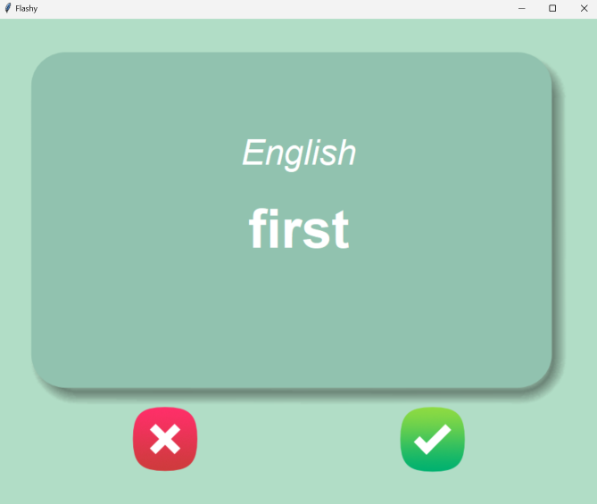

# Flashy - The flashcard App

## This project is created using python 3.12, PyCharm IDE, tkinter, pandas.

### Steps to run the project
1. Install python 3.12
2. Open project in the python IDE
3. Install panda module
4. Run the project

### Working of the project
- File french_words.csv in data folder contains 101 common French words with their English meaning.
- 
- A random French word will show up on the flashcard upon running the program.
- 
- After 3 seconds, flashcard flips to show the English meaning.
- If user clicks ✅ button then it means the user knows the meaning of the displayed French word and that will not appear again.
- If user clicks ❌ button, this signifies that the user does not know the meaning of the displayed French word and that word will appear again.
- If user close the application then the remaining words will be saved to a file named words_to_learn.csv in the data folder.
- Next time when the user launch the application it will try to open the file words_to_learn.csv if it exist otherwise open the french_words.csv file.
- To reset the application just delete the words_to_learn.csv file.

# Created by Aqib Ali

